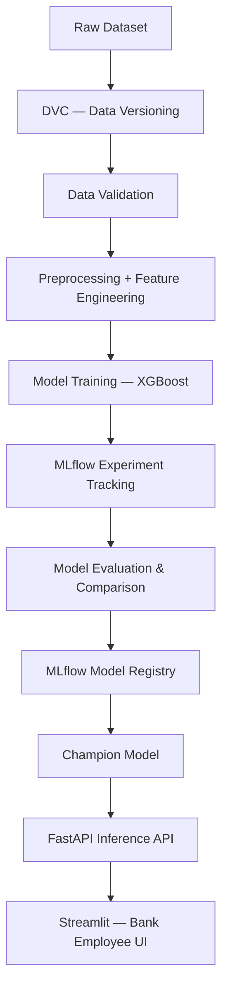
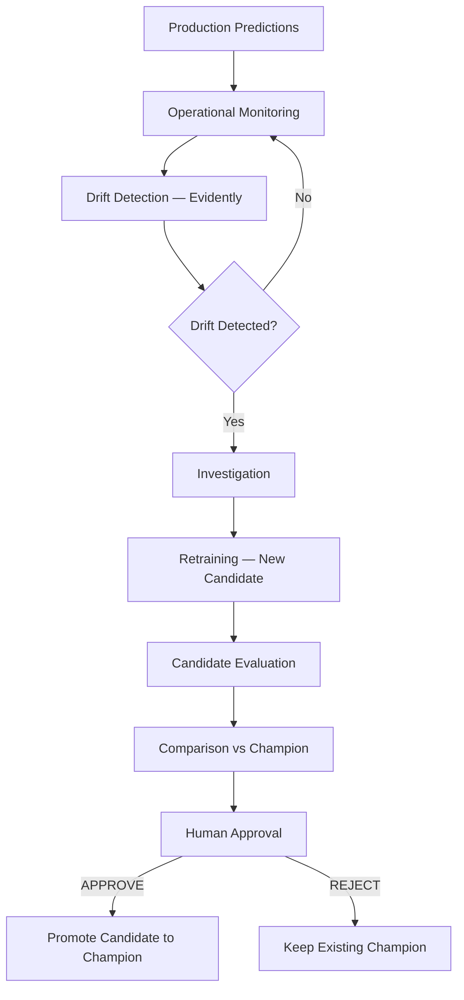

# Credit Card Fraud Detection MLOps

An end-to-end, production-ready MLOps pipeline for detecting financial transaction fraud using XGBoost. The system covers the full model lifecycle — from raw data ingestion and validation through training, experiment tracking, registry management, and live inference. Transactions are served through a FastAPI REST API and a Streamlit web application designed for bank employees.

---

## Overview

Financial fraud is rare but costly. In this dataset, fraudulent transactions represent less than 0.2% of all activity, making class imbalance the central modelling challenge. The system trains an XGBoost classifier that produces a fraud probability for each transaction; a calibrated operating threshold converts that probability into a binary fraud / not-fraud decision.

The pipeline is fully reproducible via DVC and MLflow. A validated Champion model is registered in the MLflow Model Registry and loaded at API startup. Operational monitoring and Evidently-based drift detection run continuously; when drift is detected, a controlled retraining and human-approval workflow governs whether the Champion is replaced.

---

## Key Features

- **Transaction fraud prediction** — probability score and binary classification per transaction
- **Streamlit UI** — browser-based interface for bank employees to check individual transactions
- **FastAPI inference API** — REST endpoints for health, prediction, model info, and monitoring
- **XGBoost classifier** — trained with `scale_pos_weight` to handle severe class imbalance
- **Feature engineering** — balance differentials and amount-ratio features derived from raw fields
- **MLflow experiment tracking** — parameters, metrics, and artifacts logged per run
- **MLflow Model Registry** — `CreditCardFraudDetector` with `@champion` and `@candidate` aliases
- **DVC dataset and pipeline versioning** — 5-stage reproducible pipeline (`dvc.yaml`)
- **Automated data validation** — schema, type, null, duplicate, and numerical sanity checks
- **Model evaluation and comparison** — Precision, Recall, F1, ROC-AUC, PR-AUC across strategies and thresholds
- **Operational monitoring** — in-process request, latency, and prediction-distribution metrics
- **Prometheus + Grafana** — metrics exposition and pre-built dashboard
- **Drift detection** — Evidently-based feature-level drift analysis against the reference dataset
- **Retraining workflow** — candidate creation, evaluation, and comparison against the Champion
- **Human approval gate** — explicit operator approval required before any drift-driven candidate replaces the Champion
- **Automated tests** — Pytest suite covering data, features, models, API, monitoring, and drift
- **Docker + Docker Compose** — containerised API, Prometheus, and Grafana
- **GitHub Actions CI** — dependency install, compile check, full test suite, Docker build, and API smoke test

---

## Architecture

### Initial Model Lifecycle



Human approval is **not** part of this path. The initial baseline model is validated and registered as Champion automatically.

### Production Monitoring / Drift Lifecycle



Human approval is **only** required when a drift-driven retraining produces a candidate that may replace the existing Champion. Drift does not automatically replace the production Champion model.

---

## Component Responsibilities

| Component | Purpose |
|---|---|
| DVC | Dataset and pipeline reproducibility; tracks raw data and pipeline stage outputs |
| Data Validation | Schema, type, null, duplicate, and numerical sanity checks on raw input |
| Feature Engineering | Derives balance-differential and amount-ratio features from raw transaction fields |
| XGBoost | Binary fraud classifier trained with `scale_pos_weight` for class imbalance |
| MLflow | Experiment tracking — logs parameters, metrics, and model artifacts per run |
| MLflow Model Registry | Stores registered model versions; manages `@champion` and `@candidate` aliases |
| FastAPI | Production inference API — `/predict`, `/health`, `/model-info`, `/monitoring`, `/metrics` |
| Streamlit | Browser UI for bank employees to check individual transactions for fraud risk |
| Prometheus | Scrapes `/metrics` and stores time-series operational data |
| Grafana | Pre-provisioned dashboard for request rate, error rate, latency, and fraud distribution |
| Drift Detection | Evidently-based feature-level drift comparison against the reference dataset |
| Docker / Compose | Containerises the API, Prometheus, and Grafana for consistent local deployment |
| GitHub Actions | CI — installs dependencies, compiles code, runs tests, builds Docker image, smoke-tests API |

---

## Project Structure

```text
credit-card-fraud-mlops/
├── app/                        # FastAPI application
│   ├── main.py                 # Routes: /health, /predict, /model-info, /monitoring, /metrics
│   ├── model_loader.py         # Loads CreditCardFraudDetector@champion from MLflow
│   ├── monitoring.py           # In-process operational metrics state
│   ├── prometheus_metrics.py   # Prometheus counters and histograms
│   └── schemas.py              # Pydantic request/response models
├── src/                        # Core Python package
│   ├── config.py               # Environment variable configuration
│   ├── data/
│   │   ├── validation.py       # Data validation logic
│   │   └── preprocessing.py    # Preprocessing transformations
│   ├── features/
│   │   └── feature_engineering.py
│   ├── models/
│   │   ├── train.py            # Model training
│   │   ├── evaluate.py         # Metrics evaluation
│   │   ├── tracking.py         # MLflow run helpers
│   │   ├── compare.py          # Champion vs candidate comparison
│   │   ├── registry.py         # Model registration and alias management
│   │   ├── validate.py         # Pre-promotion validation gates
│   │   ├── retraining.py       # Retraining orchestration
│   │   ├── promotion.py        # Candidate promotion logic
│   │   └── approval.py         # Human approval record management
│   └── monitoring/
│       └── drift.py            # Evidently drift detection
├── scripts/                    # Executable pipeline and operational scripts
│   ├── validate_data.py
│   ├── preprocess_data.py
│   ├── create_features.py
│   ├── train_model.py
│   ├── evaluate_and_register.py
│   ├── compare_models.py
│   ├── detect_drift.py
│   ├── retrain_model.py
│   └── approve_model.py
├── tests/                      # Pytest test suite
├── notebooks/                  # Exploratory analysis notebooks
├── data/
│   ├── raw/                    # Immutable raw dataset (DVC-tracked)
│   └── processed/              # Preprocessed and feature-engineered parquet files
├── models/                     # Trained model artifact (xgboost_fraud_model.joblib)
├── reports/
│   ├── model/                  # Metrics, confusion matrix, ROC/PR curves, selection report
│   ├── drift/                  # Drift HTML report and JSON summary
│   ├── eda/                    # EDA visualisations
│   ├── validation/             # Data validation report
│   └── preprocessing/          # Preprocessing and feature engineering reports
├── monitoring/
│   ├── prometheus/prometheus.yml
│   └── grafana/                # Provisioning config and dashboard JSON
├── .github/workflows/ci.yml    # GitHub Actions CI workflow
├── streamlit_app.py            # Streamlit bank employee UI
├── dvc.yaml                    # 5-stage DVC pipeline definition
├── dvc.lock                    # Locked pipeline state
├── params.yaml                 # All pipeline and model configuration
├── Dockerfile                  # Inference-only Docker image
├── docker-compose.yml          # API + Prometheus + Grafana stack
└── requirements.txt            # Full Python dependencies
```

---

## Model & Prediction

**Model type**: XGBoost binary classifier wrapped in a scikit-learn `ImbPipeline` (StandardScaler + OneHotEncoder + XGBoost).

**Target variable**: `isFraud` (0 = legitimate, 1 = fraudulent).

**Raw input fields** (submitted by the user or API caller):

| Field | Description |
|---|---|
| `type` | Transaction type: `CASH_IN`, `CASH_OUT`, `DEBIT`, `PAYMENT`, `TRANSFER` |
| `amount` | Transaction amount (≥ 0) |
| `oldbalanceOrg` | Sender's balance before the transaction |
| `newbalanceOrig` | Sender's balance after the transaction |
| `oldbalanceDest` | Receiver's balance before the transaction |
| `newbalanceDest` | Receiver's balance after the transaction |

**Engineered features** derived automatically before inference:

- `balance_diff_orig` — change in sender's balance
- `balance_diff_dest` — change in receiver's balance
- `amount_ratio_orig` — transaction amount relative to sender's opening balance

**Prediction output**: a fraud probability between 0 and 1. If the probability meets or exceeds the operating threshold of **0.90**, the transaction is classified as fraud.

---

## Model Performance

Three class-imbalance strategies were evaluated. The selected strategy is `scale_weight_only` (XGBoost `scale_pos_weight`, no SMOTE) at operating threshold **0.90**.

### Strategy Comparison

| Strategy | Precision | Recall | F1 | PR-AUC | FP | FN |
|---|---|---|---|---|---|---|
| baseline_smote_scale_weight | 0.032 | 0.999 | 0.062 | 0.987 | 74,894 | 3 |
| smote_only | 0.794 | 0.998 | 0.884 | 0.989 | 638 | 5 |
| **scale_weight_only** ✓ | **0.869** | **0.996** | **0.929** | **0.989** | **369** | **9** |

### Selected Model at Threshold 0.90

| Metric | Value |
|---|---|
| Precision | 0.9099 |
| Recall | 0.9959 |
| F1 Score | 0.9510 |
| ROC-AUC | 0.9997 |
| PR-AUC | 0.9889 |
| True Positives | 2,455 |
| False Positives | 243 |
| False Negatives | 10 |
| True Negatives | 1,905,953 |

> **Why not accuracy?** With fewer than 0.2% fraudulent transactions, a model that predicts "not fraud" for every transaction achieves ~99.8% accuracy while catching zero fraud cases. Recall (catching actual fraud) and PR-AUC (performance across the full precision-recall curve) are the primary metrics for this problem.

---

## MLflow

MLflow tracks every training run and manages the model registry.

```
Training Run
  → Experiment Tracking (parameters, metrics, artifacts)
  → Model Registration → CreditCardFraudDetector
  → @champion alias assigned to the validated baseline
```

- **Tracking URI**: `file:./mlruns` (local file store)
- **Experiment**: `fraud_detection_experiments`
- **Registered model**: `CreditCardFraudDetector`
- **Champion alias**: `@champion`
- **Candidate alias**: `@candidate` (used only during drift-driven retraining)

The API loads the Champion at startup via:

```python
mlflow.sklearn.load_model("models:/CreditCardFraudDetector@champion")
```

Human approval is **not** required for the initial baseline registration. It applies only when a drift-driven candidate is proposed to replace the existing Champion.

Launch the MLflow UI:

```bash
MLFLOW_ALLOW_FILE_STORE=true mlflow ui
```

Then open `http://127.0.0.1:5000`.

---

## DVC

DVC versions the raw dataset and defines a 5-stage reproducible pipeline.

**Versioned data**:
- `data/raw/AIML DATASET.csv` — 6,362,620 rows × 11 columns
- `data/processed/preprocessed.parquet`
- `data/processed/cleaned.parquet`

**Pipeline stages** (`dvc.yaml`):

```
validate   → preprocess   → features   → train   → evaluate
```

| Stage | Script | Output |
|---|---|---|
| `validate` | `scripts/validate_data.py` | `reports/validation/data_validation_report.json` |
| `preprocess` | `scripts/preprocess_data.py` | `data/processed/preprocessed.parquet` |
| `features` | `scripts/create_features.py` | `data/processed/cleaned.parquet` |
| `train` | `scripts/train_model.py` | `models/xgboost_fraud_model.joblib` |
| `evaluate` | `scripts/evaluate_and_register.py` | `reports/model/metrics.json`, `reports/model/model_metadata.json` |

```bash
dvc dag          # visualise the pipeline DAG
dvc status       # check which stages are out of date
dvc repro        # reproduce the full pipeline end-to-end
```

---

## Monitoring & Drift Detection

### Operational Monitoring

The API tracks in-process aggregate metrics accessible at `GET /monitoring`:

- Request count, latency, and response status distribution
- Error count and error rate
- Fraud / not-fraud prediction counts and probability statistics
- Predictions below and at/above the 0.90 threshold
- Data-quality validation errors by category

Prometheus scrapes `GET /metrics` (Prometheus exposition format). Grafana provisions a pre-built dashboard covering request rate, error rate, p95 latency, fraud prediction rate, probability distribution, and Champion model information.

### Drift Detection

Drift detection compares incoming production data against the reference dataset (`data/processed/cleaned.parquet`) using Evidently across the nine production feature columns.

```bash
python scripts/detect_drift.py --current path/to/current.parquet
```

Reports are written to `reports/drift/drift_report.html` and `reports/drift/drift_summary.json`.

**Drift does not automatically replace the production Champion model.** Detection is an investigation signal that initiates the retraining and human-approval workflow described below.

---

## Running the Project

### 1. Environment Setup

```bash
git clone <repository-url>
cd credit-card-fraud-mlops
python3 -m venv venv
source venv/bin/activate
pip install -r requirements.txt
```

Copy and configure the environment file:

```bash
cp .env.example .env
```

### 2. Data Setup

```bash
dvc pull
```

This restores the DVC-tracked raw dataset and processed artefacts from the configured remote.

### 3. Reproduce the Pipeline (optional)

```bash
dvc repro
```

Runs all five pipeline stages in order. Skip this step if the processed artefacts and model are already present.

### 4. Start MLflow

```bash
MLFLOW_ALLOW_FILE_STORE=true mlflow ui
```

Available at `http://127.0.0.1:5000`.

### 5. Start FastAPI

```bash
python -m uvicorn app.main:app --host 127.0.0.1 --port 8000
```

Available at `http://127.0.0.1:8000`. Swagger UI at `/docs`, ReDoc at `/redoc`.

### 6. Start Streamlit

```bash
streamlit run streamlit_app.py
```

Available at `http://localhost:8501` by default.

### 7. Docker (API + Prometheus + Grafana)

```bash
docker build -t credit-card-fraud-api:latest .
docker compose up -d
```

| Service | URL |
|---|---|
| FastAPI | `http://localhost:8000` |
| Prometheus | `http://localhost:9090` |
| Grafana | `http://localhost:3001` |

```bash
docker compose ps        # check container status
docker compose logs api  # view API logs
docker compose down      # stop all services
```

Set `GRAFANA_ADMIN_USER` and `GRAFANA_ADMIN_PASSWORD` in `.env` to override the default local credentials.

---

## Using the Application

1. Open the Streamlit UI at `http://localhost:8501`
2. Use **Load Normal Transaction** or **Load Suspicious Transaction** to populate example values, or enter transaction details manually
3. Select the **Transaction Type** (`CASH_IN`, `CASH_OUT`, `DEBIT`, `PAYMENT`, `TRANSFER`)
4. Enter the **Transaction Amount** and the sender/receiver account balances before and after the transaction
5. Click **Check Transaction**
6. Review the result card — it shows whether the transaction appears legitimate or is a potential fraud, along with the fraud risk percentage
7. If fraud risk is high, investigate or escalate the transaction before proceeding

---

## API

Base URL: `http://127.0.0.1:8000`  
Interactive docs: `/docs` (Swagger UI) · `/redoc` (ReDoc)

| Method | Endpoint | Description |
|---|---|---|
| `GET` | `/health` | Service and Champion model load status |
| `POST` | `/predict` | Predict fraud probability for one transaction |
| `GET` | `/model-info` | Non-sensitive Champion model metadata |
| `GET` | `/monitoring` | Aggregate operational metrics summary |
| `GET` | `/metrics` | Prometheus metrics exposition |

### `/predict` Example

**Request**:
```json
{
  "type": "TRANSFER",
  "amount": 1000.0,
  "oldbalanceOrg": 1000.0,
  "newbalanceOrig": 0.0,
  "oldbalanceDest": 0.0,
  "newbalanceDest": 1000.0
}
```

**Response**:
```json
{
  "is_fraud": true,
  "fraud_probability": 0.97,
  "threshold": 0.9,
  "model_name": "CreditCardFraudDetector",
  "model_alias": "champion"
}
```

---

## Testing

```bash
pytest -q
```

The test suite covers:

- Data validation logic
- Preprocessing transformations
- Feature engineering
- Model training and evaluation
- MLflow tracking and registry
- Model comparison and validation
- API endpoints and schemas
- Monitoring state
- Prometheus metrics
- Drift detection
- Retraining and promotion workflows
- Human approval logic
- DVC pipeline configuration

---

## CI

The GitHub Actions workflow (`.github/workflows/ci.yml`) runs on every push and pull request to `main`:

1. Install Python 3.11 and `requirements.txt`
2. Compile `app/` and `src/` with `python -m compileall`
3. Run the full Pytest suite
4. Build the Docker image
5. Start the container and smoke-test `/health`, `/model-info`, `/docs`, `/redoc`, and `/predict`

The CI workflow does not run DVC, retrain models, or modify the MLflow Champion alias. On a clean runner without a local `mlruns/` directory, the `/predict` smoke test expects a `503` response (Champion unavailable) rather than fabricating a model artefact.

---

## Retraining & Model Promotion

When drift is detected or new labelled data becomes available:

```
New Data / Drift Alert
  → DVC Versioning
  → Validation → Preprocessing → Feature Engineering
  → Training → MLflow Candidate
  → Candidate Evaluation → Champion Comparison
  → Promotion Report → Human Approval → Promote / Reject
```

**Create a candidate and compare against the Champion**:

```bash
python scripts/retrain_model.py --new-data data/raw/new_data.csv
```

**Review and approve a pending candidate**:

```bash
python scripts/approve_model.py \
  --report reports/model/promotion_decision.json \
  --operator <operator-name>
```

The CLI requires the exact input `APPROVE` to promote. Any other input (including `yes`, `y`, `1`) cancels safely. `REJECT` records the operator and reason, leaves the Champion unchanged, and retains the candidate for investigation.

**Promotion gates** (configured in `params.yaml`):

| Gate | Default |
|---|---|
| Minimum recall delta | 0.0 (no regression) |
| Minimum PR-AUC delta | 0.0 (no regression) |
| Minimum F1 improvement | 0.001 |

Approval records are written to `reports/model/approval_history.json` and `reports/model/approval_decision.md`. Previous Champion versions remain registered for rollback.

---

## Configuration

### `params.yaml`

Central configuration for all pipeline stages and model settings. Key sections:

| Section | Controls |
|---|---|
| `data_validation` | Required columns, types, target column |
| `preprocessing` | Input/output paths, columns to drop |
| `feature_engineering` | Enable/disable balance diffs and amount ratio |
| `data_split` | Test size, random state, stratification |
| `model` | Strategy, threshold (0.90), XGBoost hyperparameters |
| `mlflow` | Tracking URI, experiment name, registered model name, aliases |
| `promotion` | Minimum metric deltas for candidate promotion |
| `threshold_analysis` | Thresholds evaluated during model selection |

### Environment Variables (`.env`)

Copy `.env.example` to `.env` and set values as needed. Key variables:

| Variable | Default | Purpose |
|---|---|---|
| `MLFLOW_TRACKING_URI` | `file:./mlruns` | MLflow tracking store location |
| `MLFLOW_ALLOW_FILE_STORE` | `true` | Required for local file-based MLflow store |
| `FRAUD_API_URL` | `http://127.0.0.1:8000` | Streamlit → API base URL |
| `GRAFANA_ADMIN_USER` | `admin` | Grafana admin username |
| `GRAFANA_ADMIN_PASSWORD` | `admin` | Grafana admin password |

Do not commit `.env` or any real credentials to version control.

---

## Reproducibility

| Tool | Role |
|---|---|
| Git | Versions all code, configuration, and pipeline definitions |
| DVC | Versions datasets and pipeline stage outputs; `dvc repro` re-executes the full pipeline deterministically |
| MLflow | Tracks every experiment run with parameters, metrics, and artefacts; the Model Registry preserves all registered versions |

Together, any combination of Git commit + DVC lock + MLflow run ID uniquely identifies the data, code, and model that produced a given result.

---

## Troubleshooting

**FastAPI won't start — `Champion model is unavailable`**  
The `mlruns/` directory or the `@champion` alias is missing. Run `dvc repro` to regenerate the model, then verify the alias exists in the MLflow UI.

**`MLFLOW_ALLOW_FILE_STORE` error**  
Set the environment variable before starting the API or MLflow UI:
```bash
export MLFLOW_ALLOW_FILE_STORE=true
```
The Docker image and `docker-compose.yml` set this automatically.

**Streamlit cannot connect to FastAPI**  
Confirm the API is running on `http://127.0.0.1:8000`. Override the URL with:
```bash
FRAUD_API_URL=http://127.0.0.1:8000 streamlit run streamlit_app.py
```

**DVC data unavailable**  
Run `dvc pull` to restore tracked data from the configured remote. If the remote is not configured, check `.dvc/config`.

**Docker Compose — port already in use**  
Grafana maps to host port `3001` to avoid conflicts with a locally running Grafana on `3000`. If `8000` or `9090` are occupied, stop the conflicting process or adjust the port mapping in `docker-compose.yml`.

**Candidate promotion fails validation**  
Check `reports/model/promotion_decision.json` for the specific gate that was not met. The candidate must not regress on Recall or PR-AUC and must improve F1 by at least 0.001.

---

## Development / Extending the Project

| Area | Location |
|---|---|
| Data validation rules | `src/data/validation.py` |
| Preprocessing steps | `src/data/preprocessing.py` |
| Feature engineering | `src/features/feature_engineering.py` |
| Model training | `src/models/train.py` |
| Model evaluation | `src/models/evaluate.py` |
| MLflow tracking helpers | `src/models/tracking.py` |
| Model comparison logic | `src/models/compare.py` |
| Registry and alias management | `src/models/registry.py` |
| Promotion gates | `src/models/validate.py`, `src/models/promotion.py` |
| Human approval | `src/models/approval.py` |
| Drift detection | `src/monitoring/drift.py` |
| API routes | `app/main.py` |
| Request/response schemas | `app/schemas.py` |
| Operational monitoring state | `app/monitoring.py` |
| Prometheus metrics | `app/prometheus_metrics.py` |
| Tests | `tests/` |
| Pipeline scripts | `scripts/` |
| Pipeline definition | `dvc.yaml` |
| All configuration | `params.yaml` |

When adding a new feature, add corresponding tests in `tests/` and update `params.yaml` if the feature introduces new configuration.

---

## Security & Data Considerations

- Do not commit the raw dataset (`data/raw/`) — it is tracked by DVC and excluded by `.gitignore`
- Do not commit `.env` or any real credentials — use `.env.example` as the template
- The API does not log raw transaction payloads, account identifiers (`nameOrig`, `nameDest`), or high-cardinality request values as metric labels
- Monitoring stores only aggregate statistics in process-local memory; no request bodies are persisted
- Keep production credentials, MLflow backend URIs, and cloud storage keys outside version control

---

## Limitations & Future Improvements

- **Local MLflow and DVC storage** — the current setup uses a local file store (`file:./mlruns`) and a local DVC remote (`.dvc/storage`). A production deployment would use a remote tracking server (e.g. MLflow on EC2 or Databricks) and cloud object storage (e.g. S3) for DVC
- **No authentication on the API** — the FastAPI service has no authentication or authorisation layer; adding OAuth2 or API key validation would be required before public exposure
- **No CD pipeline** — the GitHub Actions workflow covers CI only (test, build, smoke test); automated deployment to a cloud environment is not configured
- **Single-replica monitoring** — the in-process monitoring counters reset on restart and are not shared across replicas; a production setup would require a centralised metrics backend
- **Streamlit is a local development UI** — it is not hardened for multi-user or public deployment

---

## License

No license is currently specified in this repository.
